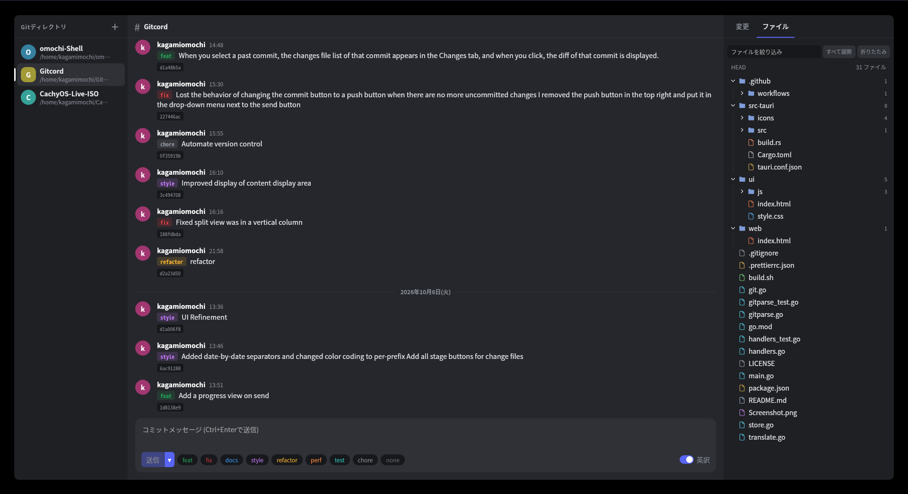

# Gitcord

DiscordライクなチャットUIで操作するGitクライアントです。

Gitディレクトリを左のDM欄に並べ、コミット履歴をチャットのように読み、メッセージ送信欄からコミットできます。



## 特徴

- **チャット風の履歴表示**: 下が新しく、上に行くほど古いコミット。スクロールで最初のコミットまで遡れます
- **未プッシュの強調**: まだpushしていないコミットは色を変えて表示
- **履歴の編集**: コミットを右クリックして、未プッシュなら `reset`(soft / mixed / hard)、プッシュ済みなら `revert`
- **コミット時点の閲覧**: コミットをクリックすると、その時点のファイル構造が見られ、ファイルをクリックするとその時点のファイル内容を表示
- **変更ファイルのdiff**: 「変更」タブでファイルをクリックすると、そのファイルのdiffを表示
- **ステージ操作**: 未コミットの変更を一覧し、チェックボックスでステージを切り替え
- **プレフィックス付きコミット**: `feat` `fix` `docs` `style` `refactor` `perf` `test` `chore` のボタンをワンクリックで付与。プレフィックスなしの場合も `none` を押す必要があり、押し忘れによるコミットを防ぎます
- **コミットメッセージの自動英訳**: ON/OFFを切り替え可能(デフォルトON)
- **Gitディレクトリの追加**: アプリ内のファイルマネージャーで選択(Gitディレクトリにはバッジ表示)、またはcloneして追加(clone先とディレクトリ名を指定)
- **認証は既存の設定をそのまま利用**: 内部で `git` コマンドを呼ぶだけなので、credential helperやSSH鍵の設定がそのまま使えます

## インストール

対応OSは現在Linuxのみです。[Releases](../../releases) から、ディストリビューションに合ったファイルをダウンロードしてください。

| 形式 | 主な対象 |
| --- | --- |
| `.AppImage` | ほとんどのディストリビューション |
| `.deb` | Debian / Ubuntu系 |
| `.rpm` | Fedora / openSUSE系 |

AppImageは実行権限を付けて起動します。

```
chmod +x Gitcord_*.AppImage
./Gitcord_*.AppImage
```

実行には `git` がインストールされている必要があります。

## 使い方

1. 左上の「＋」からGitディレクトリを追加します。既存のディレクトリを選ぶか、URLを指定してcloneします。
2. 左の一覧からディレクトリを選ぶと、中央にコミット履歴が表示されます。
3. 右の「変更」タブで、コミットしたいファイルにチェックを入れてステージします。ファイル名をクリックするとdiffが開きます。
4. 下の入力欄にメッセージを書き、プレフィックス(または `none`)を選んで「送信」を押します。コミットに続けてpushまで自動で行われます。
5. コミットだけしたい場合は、「送信」の隣の「▾」から「コミットのみ」を選びます。この場合pushはされません。
6. コミットせずにpushだけしたい場合は、「送信」の隣の「▾」から「pushのみ」を選びます。

メッセージは Ctrl+Enter でも送信できます(コミット→push)。pushに失敗した場合もコミット自体は完了しており、エラー内容がトーストで表示されます。

## 注意事項

- **英訳機能とプライバシー**: コミットメッセージの文面を翻訳サービス(既定は MyMemory、環境変数 `GITCORD_DEEPL_KEY` を設定した場合は DeepL API Free)に送信します。機密性の高い内容を扱う場合は、英訳をOFFにしてください。OFFにすると、ネットワークには何も送りません。
  - `GITCORD_DEEPL_KEY`: DeepL API Free のキー。設定すると DeepL を優先して使います。
  - `GITCORD_MYMEMORY_EMAIL`: MyMemory の連絡用メールアドレス。設定すると無料枠が 5,000 文字/日から 50,000 文字/日に増えます。
  - 英訳に失敗した場合は、原文のままコミットするか確認ダイアログが表示されます。
- **データの保存場所**: 追加したディレクトリの一覧は `~/.config/gitcord/repos.json` に保存されます。
- **ローカル通信のみ**: 内部のサーバーは `127.0.0.1` でのみ待ち受け、外部からは接続できません。

## トラブルシューティング

### Waylandで起動しない(`Error 71 (Protocol error) dispatching to Wayland display`)

WebKitGTKとの相性問題で、NVIDIA環境などで起きることがあります。次の環境変数を付けて起動してみてください。

```
GDK_BACKEND=x11 ./Gitcord_*.AppImage
```

AppImageで解決しない場合は、お使いのディストリビューションで [ソースからビルド](#ソースからビルド) すると、システムのWebKitGTKが使われるため安定することがあります。

## 既知の制限

- Linuxのみ対応です(Windows・macOSは未対応)
- 履歴は直近5000件までを一括で読み込みます
- 履歴編集コマンドは reset と revert のみです(rebase、amendなどは未対応)
- cloneの進捗は表示されません

## ソースからビルド

必要なもの: Go 1.22以上、Rust(stable)、Node.js、[Tauriの依存ライブラリ](https://v2.tauri.app/start/prerequisites/#linux)

```
TRIPLE=$(rustc -vV | sed -n 's/host: //p')
mkdir -p src-tauri/binaries
CGO_ENABLED=0 go build -ldflags="-s -w" -o src-tauri/binaries/gitcord-server-$TRIPLE .
npm install
npx tauri build --no-bundle
./src-tauri/target/release/gitcord
```

Tauriなしでバックエンドだけを動かして、ブラウザで試すこともできます。`http://127.0.0.1:8484`

```
go build -o gitcord .
chmod +x gitcord
./gitcord
```

### 構成

```
main.go          エントリポイント(フラグ解析、サーバー起動、UIの埋め込み)
handlers.go      HTTP APIのルーティングとハンドラー
git.go           gitコマンドの実行
gitparse.go      gitの出力(log / status / name-status)のパーサー
store.go         追加したディレクトリ一覧の保存(~/.config/gitcord/repos.json)
translate.go     コミットメッセージの英訳(DeepL / MyMemory)
*_test.go        Goのテスト(`go test ./...`)
ui/              UI本体(Goバイナリに埋め込み)
  index.html       マークアップ
  style.css        スタイル
  js/util.js       共通ヘルパー、アイコン、API呼び出し、トースト
  js/diff.js       diffのパースと描画(統合表示 / 分割表示)
  js/app.js        画面ロジック(履歴、変更、ファイル、コミット、追加ダイアログ)
src-tauri/       Tauriのラッパー(Goバックエンドをsidecarとして起動し、ウィンドウで開く)
web/             Tauriの設定上必要な起動中スプラッシュ
```

UIを変更するなら `ui/`、Git操作やAPIを変更するなら `handlers.go` / `git.go` を編集します。
